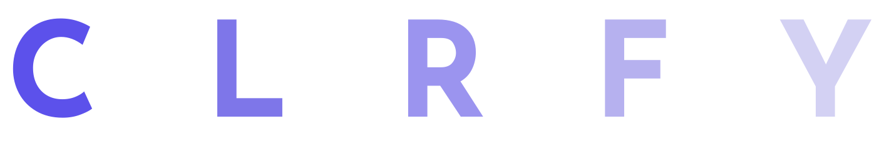
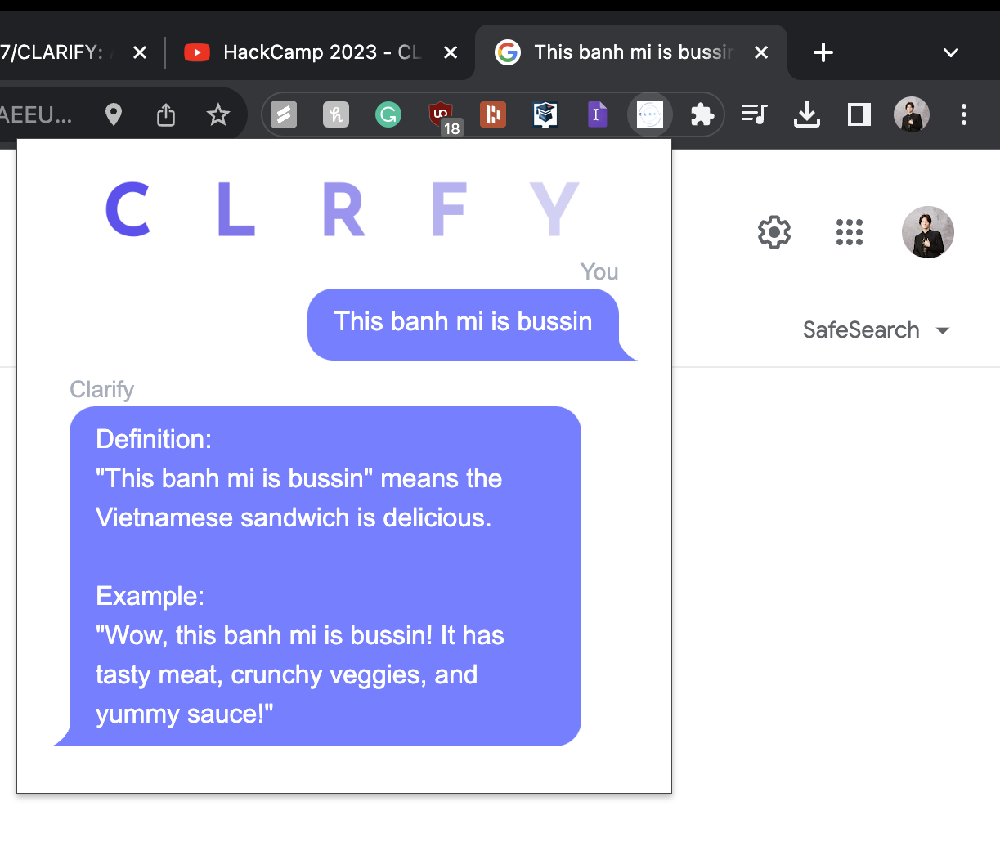

# CLARIFY

## Use case

## Inspiration
Learning a new language is hard enough, we wanted to make it easier for people to communicate with each other comfortably.
## What it does
Enabling the Chrome extension will grab the highlighted text and translate it to a common language, whether it be new slang terms or confusing idioms.
## How we built it
This project was coded using HTML, CSS, and JavaScript.  We implemented OpenAI API to handle translations through API communication and leveraged the Tailwind CSS framework for consistency in design.
## Challenges we ran into
#### Front End
Making the Chrome extension modern was difficult when we constrained ourselves to vanilla HTML and CSS. Implementing the Tailwind framework made keeping the design consistent while using DaisyUI meant we could explore different designs in a short period.
#### Back End:
Learning how to connect with the OpenAI endpoint and all the syntax/structure that the POST packages needed to follow.
## Accomplishments that we're proud of
- Creating a product that truly helps the lives of our intended audience.
- Working fluidly and efficiently as a team, both during struggles and successes.
- Bouncing different ideas off one another to find different approaches to the same problem.
- Having lots of fun.

## What we learned
- How to create a new form of software (a Chrome extension).
- The benefits of efficient Git management (pulling, pushing, merging) within a team.
- Using the OpenAI API and handling POST packages
- Implementing CSS frameworks and libraries (Tailwind CSS and DaisyUI)
## What's next for CLARIFY
- Publishing the app to the Chrome Web Store
- Making sure the communication stays as accessible as possible

Coded by Dean, Derek, Eric, and Jin at NWPlus' 2023 HackCamp
